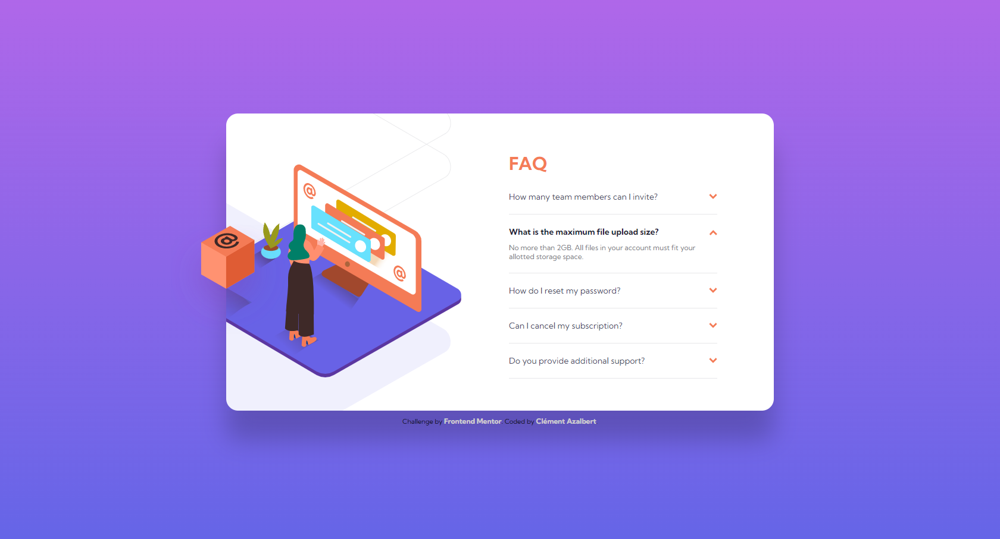

# Frontend Mentor - FAQ accordion card solution

This is a solution to the [FAQ accordion card challenge on Frontend Mentor](https://www.frontendmentor.io/challenges/faq-accordion-card-XlyjD0Oam). Frontend Mentor challenges help you improve your coding skills by building realistic projects.

## Table of contents

- [Overview](#overview)
  - [The challenge](#the-challenge)
  - [Screenshot](#screenshot)
  - [Links](#links)
- [My process](#my-process)
  - [Built with](#built-with)
  - [Continued development](#continued-development)
  - [Useful resources](#useful-resources)
- [Author](#author)

**Note: Delete this note and update the table of contents based on what sections you keep.**

## Overview

### The challenge

Users should be able to:

- View the optimal layout for the component depending on their device's screen size
- See hover states for all interactive elements on the page
- Hide/Show the answer to a question when the question is clicked

### Screenshot

Desktop Screenshot

Mobile Screenshot

### Links

- Solution URL: [Click here to see the solution](https://your-solution-url.com)
- Live Site URL: [Click here to see the live site](https://your-live-site-url.com)

## My process

### Built with

- Semantic HTML5 markup
- CSS custom properties
- Flexbox
- Vanilla JS

### Continued development

I will focus on building challenges/projects, doing some online trainings and looking up some documentations
in order to improve my JavaScript skills.

### Useful resources

- [How to create an accordion - W3Schools](https://www.w3schools.com/howto/howto_js_accordion.asp) - This helped me to make the JS code to create the accordion animation (Option 3).
- [Building an Accordion with Vanilla JavaScript](https://javascript.plainenglish.io/building-an-accordion-with-vanilla-javascript-8440ab8f07ff) - This helped me to make the JS code to create the accordion animation (Option 2).
- [FAQ accordion Card Solution](https://lm-faq-accordion-card.netlify.app/) - This helped me to make the JS code to create the accordion animation (Option 1).

## Author

- Frontend Mentor - [@Clemi05](https://www.frontendmentor.io/profile/Clemi05)
- Github - [Clemi05](https://github.com/Clemi05)
- LinkedIn - [Clément Azalbert](https://www.linkedin.com/in/clement-azalbert/)
